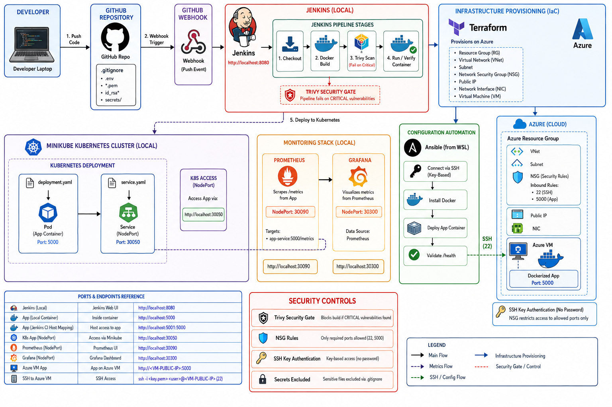

# Azure Infrastructure Automation & Monitoring Platform

Beginner-friendly, real-world DevOps project to learn CI/CD, containers, Kubernetes, monitoring, security scanning, Infrastructure as Code, and automation on Azure.

## Project Goal
This project helps prepare for:
- Junior DevOps Engineer
- Cloud Engineer
- System Engineer
- Infrastructure Engineer

## Architecture Flow
GitHub Push -> Webhook -> Jenkins Pipeline -> Docker Build -> Trivy Scan -> Kubernetes Deploy -> Prometheus Monitoring -> Grafana Dashboards -> Terraform Azure Infra -> Ansible VM Configuration

## Architecture Diagram
[](docs/architecture/diagram.png)

## Tech Stack
- Cloud: Azure
- DevOps: Git, GitHub, Jenkins, Webhooks, Docker
- Kubernetes: Minikube, kubectl
- Monitoring: Prometheus, Grafana
- Security: Trivy
- IaC: Terraform
- Automation: Ansible
- App: Lightweight Python (Flask)

## Current Progress
- [x] Step 1: Environment Verification + Project Structure
- [x] Step 2: Lightweight Python Application
- [x] Step 3: Docker Fundamentals
- [x] Step 4: Git + GitHub Workflow
- [x] Step 5: Jenkins Basic CI Pipeline
- [x] Step 6: GitHub Webhook Auto Trigger
- [x] Step 7: Trivy Security Scanning
- [x] Step 8: Kubernetes with Minikube
- [x] Step 9: Monitoring Stack
- [x] Step 10: Terraform Basics
- [x] Step 11: Ansible Automation
- [x] Step 12: Azure Deployment
- [ ] Step 13: Final Architecture Review

## Repository Structure
```text
azure-infra-automation-monitoring/
|- app/
|- docker/
|- jenkins/
|- k8s/
|- monitoring/
|  |- prometheus/
|  |- grafana/
|- terraform/
|- ansible/
|- scripts/
|- docs/
|- Jenkinsfile
|- .gitignore
```

## Quick Start (Local)
1. Run Flask app:
```powershell
cd app
python -m pip install -r requirements.txt
python app.py
```

2. Build Docker image:
```powershell
cd app
docker build -t azure-monitoring-app:v1 .
```

3. Run container:
```powershell
docker run -d --name azure-app-container -p 5000:5000 azure-monitoring-app:v1
```

4. Verify health endpoint:
```powershell
Invoke-WebRequest -UseBasicParsing http://localhost:5000/health
```

## Jenkins Pipeline
Pipeline file: `Jenkinsfile`
Main stages:
- Checkout Source
- Build Docker Image
- Trivy Security Scan
- Run Container
- Verify Health

## Kubernetes Deployment (Step 8)
Kubernetes manifests were added in `k8s/`:
- `deployment.yaml`:
  - Runs app as a managed Pod (`Deployment`)
  - Adds readiness and liveness probes on `/health`
- `service.yaml`:
  - Exposes app using `NodePort` service
  - Gives a stable access endpoint for the Pod

Why this matters (vs plain Docker):
- Docker `run` gives one local container.
- Kubernetes adds orchestration: self-healing, scaling, and stable service networking.

Commands used:
```powershell
minikube start
minikube image load azure-monitoring-app:v1
kubectl apply -f k8s/deployment.yaml
kubectl apply -f k8s/service.yaml
kubectl get pods
kubectl get svc
minikube service azure-monitoring-app-service --url
```

## Monitoring Stack (Step 9)
Monitoring manifests were added in `monitoring/`:
- Prometheus:
  - `prometheus-configmap.yaml`
  - `prometheus-deployment.yaml`
  - `prometheus-service.yaml`
- Grafana:
  - `grafana-datasource-configmap.yaml`
  - `grafana-deployment.yaml`
  - `grafana-service.yaml`

Application metrics added:
- `/metrics` endpoint in Flask app using `prometheus-client`
- Custom metric: `app_http_requests_total` with endpoint label

Why this matters for interviews:
- Shows you can deploy and observe workloads, not just run them
- Demonstrates practical observability workflow:
  - instrument app -> scrape metrics -> visualize in Grafana

Useful queries:
```promql
app_http_requests_total
sum by (endpoint) (app_http_requests_total)
rate(app_http_requests_total[1m])
```

## Terraform on Azure (Step 10)
Terraform files in `terraform/` are used to provision Azure infrastructure from code:
- `main.tf`:
  - Resource Group
  - Virtual Network + Subnet
  - Public IP
  - NSG + SSH/App rules
  - NIC + Linux VM
- `variables.tf`:
  - reusable input variables
- `outputs.tf`:
  - public IP, VM name, SSH hint
- `terraform.tfvars`:
  - environment-specific values (kept out of git)

What was provisioned:
- Resource Group: `myVm_group`
- VM: `myVm`
- Region: `Central India`
- Size: `Standard_B2ats_v2`
- Image: Ubuntu 24.04 LTS

Important workflow:
```powershell
terraform init
terraform validate
terraform plan
terraform apply
```

## Ansible Automation (Step 11)
Ansible is used to configure the Terraform-created Azure VM over SSH:
- `ansible/inventory.ini`:
  - target host, SSH user, key path
- `ansible/playbook.yml`:
  - installs and enables Docker on VM
- `ansible/deploy-app.yml`:
  - copies app files
  - builds Docker image on VM
  - runs app container
  - verifies `/health`

Result:
- Docker installed automatically on VM
- App deployed automatically via Ansible
- Health check passed (`{"health":"ok"}`)

## Azure Deployment Validation (Step 12)
Deployment path validated end-to-end:
- Terraform created Azure infra
- Ansible configured VM
- Ansible deployed app container
- NSG rule opened app port `5000`
- App reachable from public IP: `http://<public_ip>:5000/health`

Operational notes:
- Keep SSH (22) open for automation/admin access
- App port can be restricted to trusted source IPs later for hardening

## Security and Secret Safety
No private credentials should be committed to git.

Current safety rules:
- `.gitignore` blocks:
  - `terraform.tfvars`, `*.tfvars`, `*.tfplan`
  - `*.pem`, `*.ppk`, `id_rsa`, `myVm_key`
- Terraform uses SSH public key value only
- Private SSH key stays local/WSL only

Do not commit:
- private keys
- cloud access tokens
- passwords in plain text
- state files with sensitive values

## Verified So Far
- GitHub webhook reaches Jenkins through ngrok (`/github-webhook/` with `200 OK`).
- Jenkins pipeline executes build and Trivy security scan successfully.
- CI container uses host port `5001` to avoid conflict with local app port `5000`.
- Manual and webhook-triggered runs are validated in local setup.
- Minikube deployment and service are working; app is reachable via `minikube service ... --url`.
- Prometheus and Grafana are running in Minikube and application metrics are queryable.

## Notes
- Keep ngrok running while testing GitHub webhooks to local Jenkins.
- If ngrok URL changes, update GitHub webhook payload URL.

## Author
Shaunak Suryawanshii
